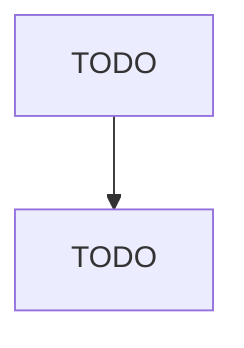

# TODO: Case Study Scenario Name

## 1. Clarify

TODO: the clarifying questions to ask before designing anything.

## 2. Framing / Metrics

TODO: what is being optimized, and how is success measured?

## 3. Architecture

TODO: walk through the architecture piece by piece.

## 4. TODO: Deeper Design Steps

TODO: add as many numbered sections as the scenario needs (data, scaling, failure modes,
evaluation, etc.) — mirror the actual flow of a live design interview.

## Trade-offs Summary

| Decision | Option A | Option B | Chosen | Why |
|---|---|---|---|---|
| TODO: | TODO: | TODO: | TODO: | TODO: |

## Say This Out Loud

> TODO: the closing monologue — the version of this answer the user would actually say if
> asked to summarize their design in 60 seconds.
