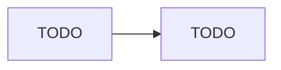

# TODO: System / Component Name

## Requirements

- **Functional**: TODO:
- **Non-functional**: TODO: (scale, latency, consistency, availability targets)

## High-Level Design

## Deep Dive: TODO Component

TODO: the part of the design most likely to get probed — walk through it in depth.

## Trade-offs

| Decision | Option A | Option B | Chosen | Why |
|---|---|---|---|---|
| TODO: | TODO: | TODO: | TODO: | TODO: |

## Failure Modes

- TODO:
- TODO:

## Say This Out Loud

> TODO: the closing monologue — the 60-second summary of this design.
