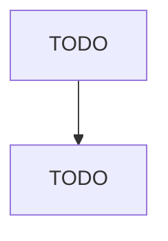

# TODO: Topic Title

## Why This Matters

TODO: one short paragraph connecting this topic to what actually gets asked in this
interview / round.

## Core Concepts

- TODO: bullet, not a paragraph
- TODO:
- TODO:

## TODO: Sub-topic

TODO: prose explanation as needed.

| TODO: dimension | TODO: option A | TODO: option B |
|---|---|---|
| TODO: | TODO: | TODO: |

## Interview Questions To Rehearse

- TODO:
- TODO:

## Interview Answer Template

> TODO: a literal spoken paragraph, in quotes, sayable in one breath, that answers the
> most likely question on this topic almost verbatim.
